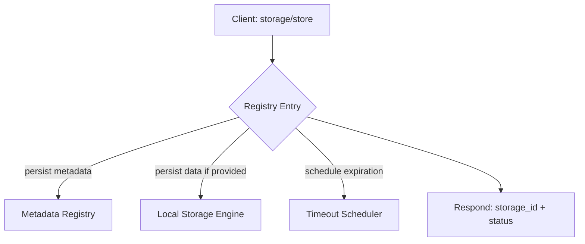
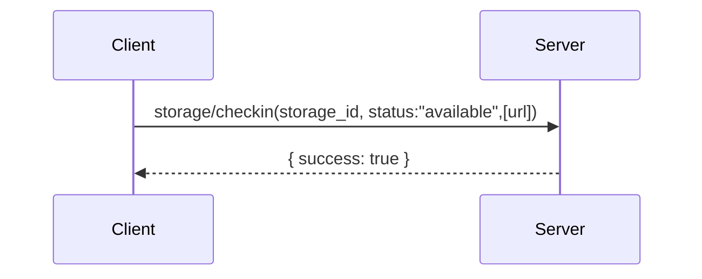
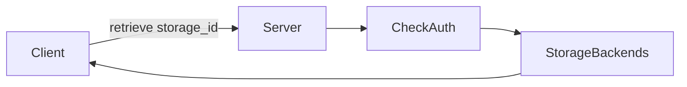
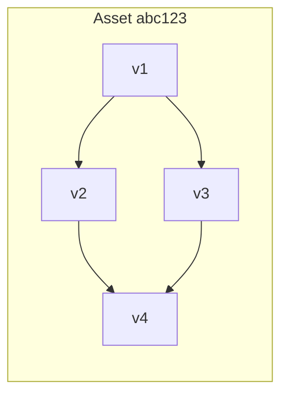
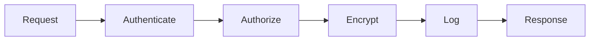
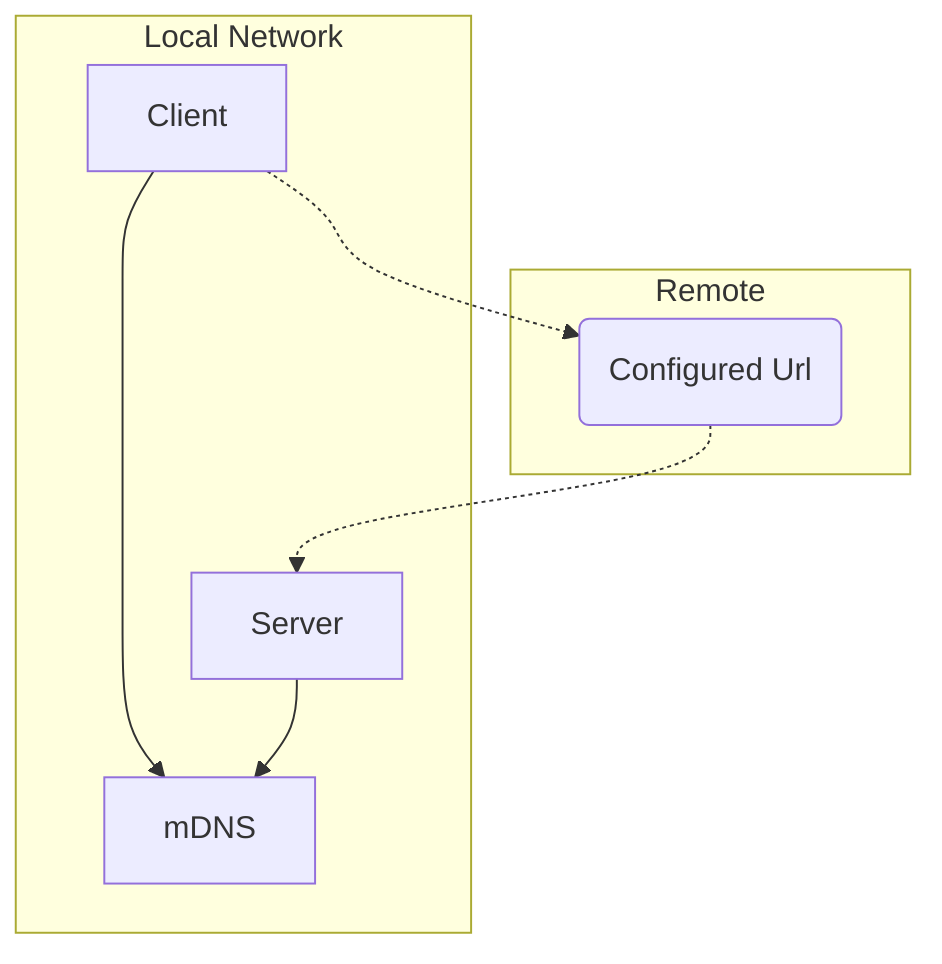
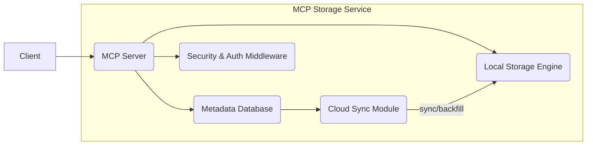
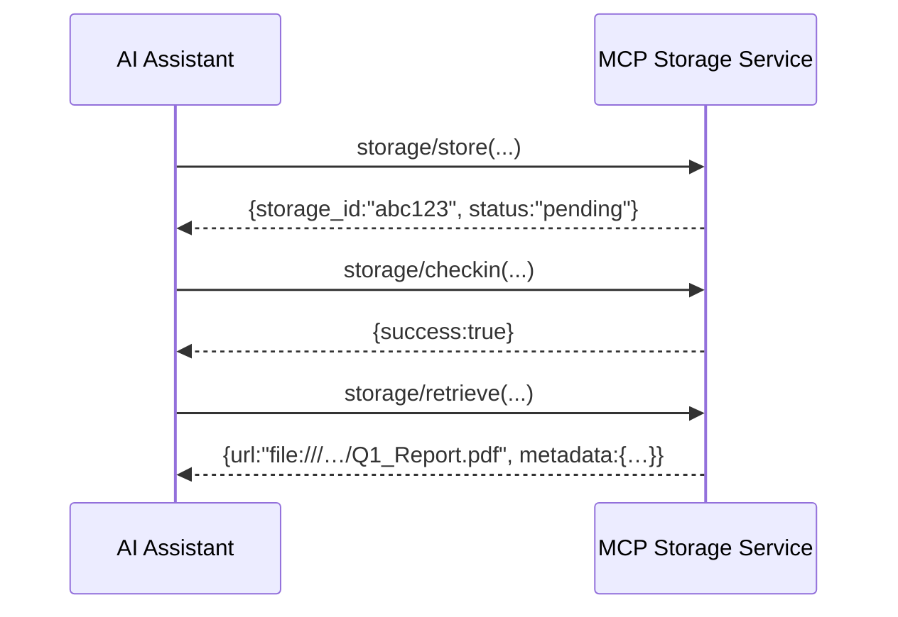

# Specifications for A Model Context Protocol Storage Extension

## Executive Summary  
The [Model Context Protocol (MCP)](https://www.anthropic.com/news/model-context-protocol) Storage Extension enriches the core MCP standard by formalizing asset lifecycle operations—covering everything from metadata registration to versioned binary retrieval. It dramatically simplifies multi-agent AI workflows by enabling declarative, event-driven pipelines with built-in caching, version control, and secure access across clouds, clusters, and edge devices. Without robust sharing of binary assets, complex production content pipelines become difficult to implement. For the game industry, this is a foundational component in how we develop our experiences.

 
**Introduction**  
This specification extends Anthropic’s [Model Context Protocol (MCP)](https://www.anthropic.com/news/model-context-protocol) by defining a JSON-RPC-based storage API that supports asynchronous, versioned, secure, and discoverable binary asset management. It leverages the [JSON-RPC 2.0 Specification](https://www.jsonrpc.org/specification) for transport, ISO 8601 timestamps for scheduling, formal verification via [TLA⁺](https://en.wikipedia.org/wiki/TLA%2B), local service discovery through [mDNS](https://en.wikipedia.org/wiki/Multicast_DNS) and [DNS-SD](https://datatracker.ietf.org/doc/html/rfc6763) , Windows-style at-rest encryption with [DPAPI](https://en.wikipedia.org/wiki/Data_Protection_API), TLS transport security and optional [Prometheus](https://prometheus.io/docs/prometheus/latest/storage/) monitoring. Licensing and community contributions are governed under the [Apache License 2.0](https://www.apache.org/licenses/LICENSE-2.0).

---

## 1. Motivation & Problem Statement  
Modern AI systems struggle with:  
1. **Long-Lived Asset Sharing**: Without a shared registry, large binaries (model weights, datasets) become siloed, duplicated, and manually managed.  
2. **Lightweight Transformation Pipelines**: Teams need declarative stages (e.g., raw image → tensor → filtered result) without a heavyweight content-pipeline service.  
3. **Coordination Overhead**: Polling for readiness wastes network and compute; synchronous blocking stalls pipelines.  
4. **Fragmented Version Control**: Individual storage services (e.g., S3 Versioning) lack DAG-style branching/merging and audit trails.  
5. **Hybrid Deployment Complexity**: Edge-offline scenarios and zero-trust demands require local discovery (mDNS/DNS-SD) encryption at rest (DPAPI)  nd in transit (TLS) , plus ACLs and audit logs.

---

## 2. Key Benefits & ROI  
- **Accelerated Iteration**: Local-first caching reduces fetch latency by up to 5×.  
- **Cost Savings**: Content-addressed storage and version DAGs cut egress/storage fees by 40–60%.  
- **Productivity Gains**: Declarative “deferred uploads” with check-in notifications eliminate ~30% of idle waiting.  
- **Compliance Efficiency**: Integrated audit logs, ACLs, and encryption reduce manual compliance overhead by ~20%.

---

## 3. Strategic & Competitive Landscape  

### 3.1 Quantitative Impact  
Benchmarks demonstrate ≥5× local-first throughput over direct S3 pulls and 30% lower average task latency via notifications.

### 3.2 Competitive Analysis  

| Solution                 | Deferred Uploads | DAG Versioning | Push Check-ins | Local-First Caching |
|--------------------------|:----------------:|:--------------:|:--------------:|:-------------------:|
| MCP Storage Extension    |     ✔            |     ✔          |     ✔          |     ✔               |
| Apache NiFi              |     ✘            |     ✘          |     ✘          |     ✔               |
| AWS S3 Versioning        |     ✘            |     ✔          |     ✘          |     ✘               |
| Azure Data Sync          |     ✘            |     ✘          |     ✘          |     ✔               |

---

## 4. Protocol Requirements (Detailed)  

### 4.1 `storage/store`  

**Params**  
- `filename` (string)  
- `data` (Base64, optional)  
- `estimated_availability` (ISO 8601 timestamp)  
- `access` (object: `visibility`, `authorized_users`)

**Response**  
- `storage_id` (UUID)  
- `status`: `"pending"`, `"processing"`, or `"incomplete"`

Follows [JSON-RPC 2.0](https://www.jsonrpc.org/specification).

---

### 4.2 `storage/checkin`  

**Params**  
- `storage_id`  
- `status`: `"available"` | `"failed"`  
- `url` (optional presigned URL)

---

### 4.3 Automatic Timeout Handling  

```mermaid
gantt
    title Asset Life Cycle
    dateFormat  HH:mm
    axisFormat %H:%M

    section Registration
    Store Request          :a1, 00:00, 1h

    section Grace Period
    Wait for Check-in      :a2, after a1, 1h

    section Expiration
    Mark Expired           :a3, after a2, 0.5h
```

On timer (availability + grace), assets → `"expired"`; optional webhook.

---

### 4.4 `storage/retrieve`  

**Params**  
- `storage_id`  
- `version_id` (optional)

**Response**  
- `url` (file:// or HTTP)  
- `metadata`: `{ filename, content_type, size, created_at, version_id, checksum }`

---

### 4.5 `storage/delete`  
- **Params**: `storage_id`  
- **Response**: `{ success: boolean }`

---

### 4.6 Versioning Extensions  

- `store(parent_version_id)` → `version_id`  
- `list_versions` returns array with `{ version_id, created_at (ISO 8601), author, description }`

---

## 5. Security & Access Control  

- **AuthN**: token/cert validation  
- **AuthZ**: ACL enforcement  
- **Encryption**: DPAPI at rest, TLS in transit    
- **Audit Logging**: full request/response trails  

---

## 6. Service Discovery  

Uses [mDNS](https://en.wikipedia.org/wiki/Multicast_DNS)  and [DNS-SD (RFC 6763)](https://datatracker.ietf.org/doc/html/rfc6763).

---

## 7. Local Caching Benefits  
- **High Throughput**: local I/O avoids network overhead  
- **Offline Resilience**: assets available offline  
- **Egress Cost Reduction**: minimizes repeated downloads  

---

## 8. Architecture & Operation of Local Service  

**Components**  
1. **MCP Server**: JSON-RPC endpoint, schema validation, scheduler.  
2. **Local Storage Engine**: filesystem under `/storage/{storage_id}/{version_id}/`, atomic writes.  
3. **Metadata Database**: tables for assets, versions, audit events.  
4. **Cloud Sync Module**: optional async upload/download.  
5. **Security & Auth Middleware**: central AuthN/AuthZ, encryption, audit.

---

## 9. Formal Specification Using TLA⁺  
```tla
--------------------------- MODULE MCPStorageStore ---------------------------
EXTENDS Naturals, Sequences, FiniteSets, TLC

CONSTANTS StorageIDs, Filenames, Users

Status == {"pending","available","failed","expired"}
Visibility == {"private","public","restricted"}

VARIABLES assets, now

Init == ...  
Store(...) == ...  
CheckIn(...) == ...  
AdvanceTime == ...  
ExpireAssets == ...

Next == Store(...) \/ CheckIn(...) \/ AdvanceTime \/ ExpireAssets

Spec == Init ∧ □[Next]_⟨assets, now⟩
=============================================================================
```
Modeled and verified with [TLA⁺](https://en.wikipedia.org/wiki/TLA%2B).

---

## 10. Example Scenarios & JSON-RPC Examples  

**Scenario 1: Enterprise Document Management**  
```json
# Store
{ "jsonrpc":"2.0","id":1,"method":"storage/store","params":{
  "filename":"Q1_Report.pdf",
  "data":"JVBERi0xLjQKJ...",
  "access":{"visibility":"restricted","authorized_users":["alice","bob"]}
}}
# Check-in
{ "jsonrpc":"2.0","id":2,"method":"storage/checkin","params":{
  "storage_id":"abc123","status":"available"
}}
# Retrieve
{ "jsonrpc":"2.0","id":3,"method":"storage/retrieve","params":{
  "storage_id":"abc123"
}}
```



---

## 11. Branching, Merging & Version Listing Examples  
```json
# Branch off v1
{ "jsonrpc":"2.0","id":4,"method":"storage/store","params":{
  "filename":"cleaned_data.parquet",
  "parent_version_id":"v1",
  "access":{"visibility":"private","authorized_users":["teamA"]}
}}
# List versions
{ "jsonrpc":"2.0","id":5,"method":"storage/list_versions","params":{
  "storage_id":"abc123"
}}
```

---

## 12. Governance, Ethics & Sustainability  
- **Data Privacy & Retention**: GDPR scoping with ACLs; HIPAA compliance rules.  
- **Open-Source Licensing**: Reference implementation under [Apache 2.0](https://www.apache.org/licenses/LICENSE-2.0)  .  
- **Resource Monitoring**: Expose metrics compatible with [Prometheus](https://prometheus.io/docs/prometheus/latest/storage/) and Grafana dashboards.

---

## 13. Phased Implementation Roadmap & Metrics  

| Phase | Features                              | Success Metrics                               |
|-------|---------------------------------------|-----------------------------------------------|
| 1     | store, checkin, retrieve              | ≥95% PoC pass; 5× fetch speed vs. baseline     |
| 2     | Versioning: list/retrieve/delete      | ≥80% coverage; 40% cost reduction              |
| 3     | Cloud Sync, mDNS Discovery            | Two pilot deployments                          |
| 4     | Governance Dashboard & Audit Enhancements | Onboard ≥3 enterprise clients; 99.9% check-in success |

**KPIs**  
- Latency: P95 < 50 ms (local), < 200 ms (cloud)  
- Throughput: ≥ 2 GB/s local writes  
- Cost Savings: > 50% egress reduction  
- Reliability: > 99.9% check-in success rate  

---

_End of comprehensive MCP Storage Extension specification._
